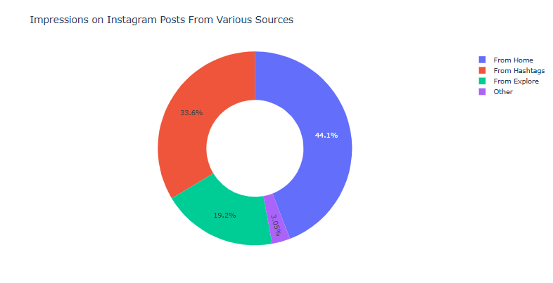
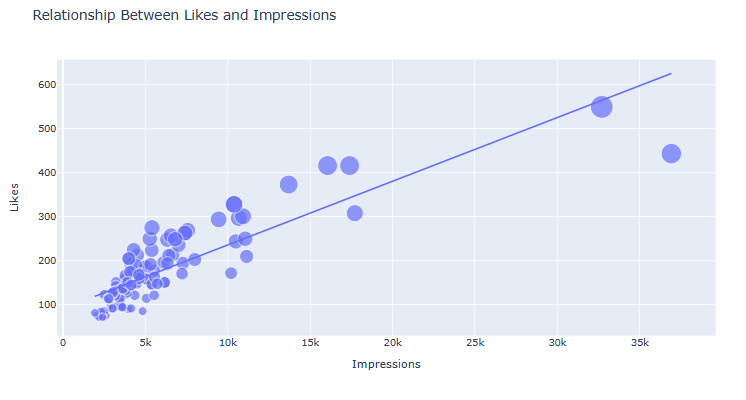

# Instagram Post Reach Analysis and Prediction

## Description

 Understanding the reach of posts is crucial for social media marketers and influencers to evaluate their impact and make informed decisions regarding their content strategy.

 The project includes two main components:

#### 1) Instagram Reach Analysis: 

This component analyzes the reach of Instagram posts based on various factors such as engagement, hashtags used, post frequency, and follower demographics. By gathering data and performing exploratory data analysis (EDA), we can gain insights into the factors influencing post reach.

#### 2) Reach Prediction:

 Using machine learning algorithms, this component predicts the potential reach of Instagram posts. By training models on historical data and considering relevant features, we can estimate the reach of future posts. This prediction can help influencers and marketers optimize their content and improve their overall reach.
## Dataset

The dataset contains the following input features 

Likes,comments,shares,saves,profile visits,follows

While the output feature is Impressions

Dataset link [https://github.com/Farhan5217/InstagramPostReachAnalysis/blob/main/Instagram_data.csv]

## Requirements

Make sure to meet the necessary Requirements 

Requirements [https://github.com/Farhan5217/InstagramPostReachAnalysis/blob/main/requirement.txt]

## Glimpes of the project

## Results

The analysis of the Instagram dataset revealed several key findings:

#### Impressions from Home: 
The impressions obtained from the home section of Instagram indicated that reaching all followers on a daily basis can be challenging. This suggests that not all posts are reaching the entire follower base consistently.

#### Hashtag Impressions: 
Hashtags played a significant role in expanding the reach of posts. While not all posts reached a wide audience through hashtags, they proved effective in attracting new users to view the content.

#### Explore Section Reach:
The explore section of Instagram, responsible for recommending posts based on user preferences, showed relatively low reach for the analyzed posts. Although some posts received good reach from the explore section, it was considerably lower compared to the reach obtained through hashtags.

#### Likes and Reach:
 A linear relationship was observed between the number of likes and the reach of Instagram posts. Higher likes correlated with a broader reach, indicating that user engagement through likes positively impacted post visibility.

#### Comments and Reach:
 The analysis indicated that the number of comments on a post did not significantly affect its reach. While comments contribute to user engagement, they did not appear to have a substantial impact on post visibility.

#### Shares and Reach:
 Posts with a higher number of shares tended to achieve a greater reach. However, the influence of shares on reach was not as significant as that of likes. A low number of shares did not significantly impact post reach.

#### Saved Posts and Reach: 
There was a linear relationship between the number of times a post was saved and its reach on Instagram. More saves correlated with a higher reach, indicating that users saving posts positively influenced post visibility.

Based on these findings, it can be concluded that receiving more likes, saves, and shares can contribute to a broader reach on Instagram. Additionally, leveraging relevant hashtags to attract new users and optimizing content for the explore section can help improve post visibility and engagement.

## Contributing 

Contributions to this project are welcome! If you have any ideas for improvements or find any issues, please open an issue or submit a pull request. Let's collaborate and make this project even better!
